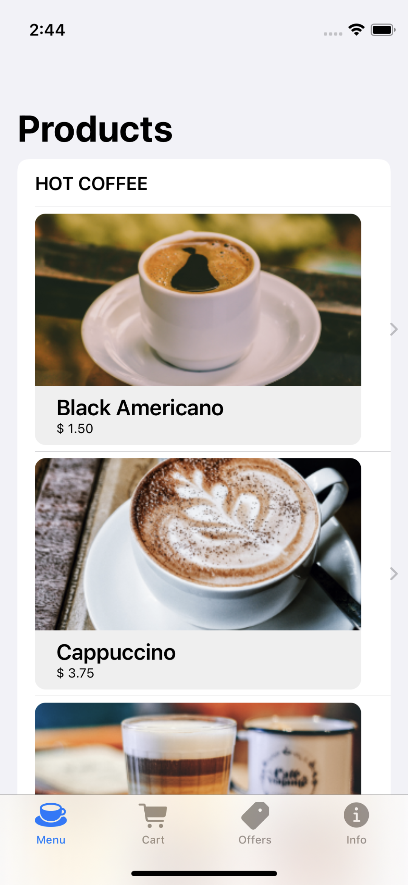
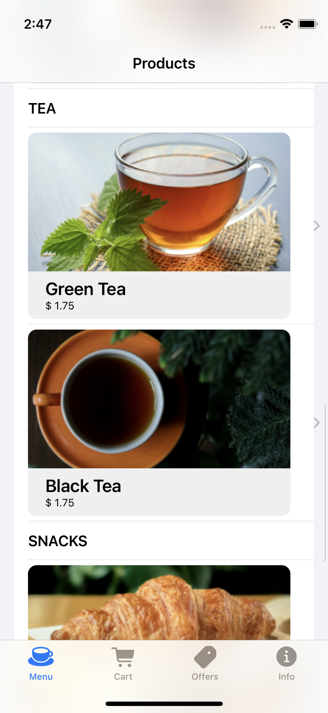
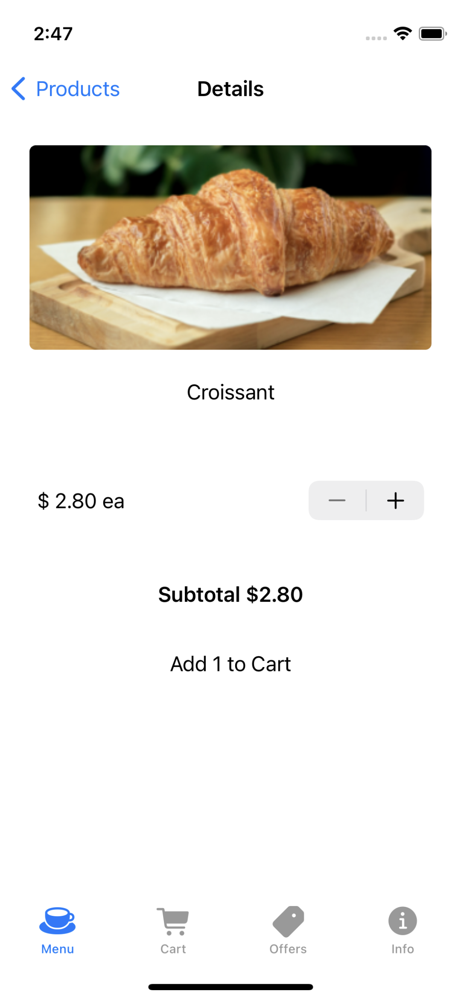
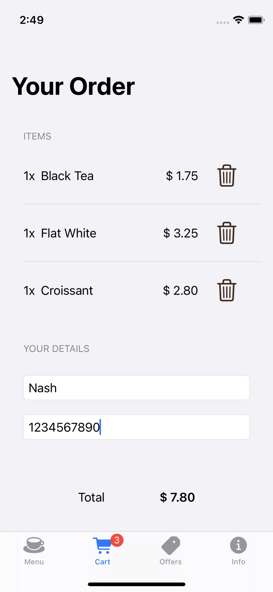
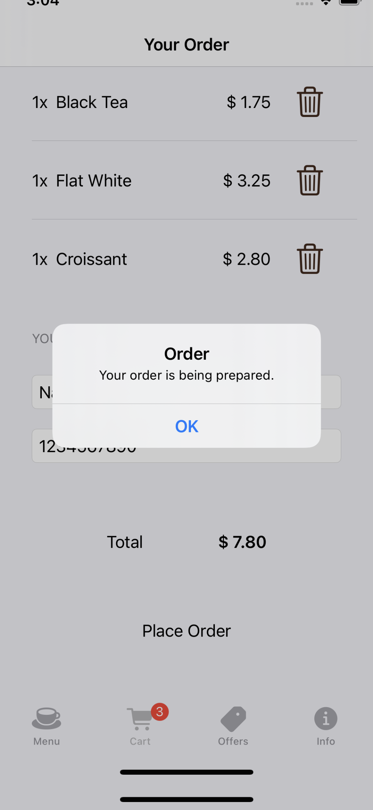

# swiftUI-coffee-masters-app

I developed this Swift UI application using XCode during my course training on "Frond end masters - Swift UI". This course and excercise helped me learn basics of the Swift, Swift UI and iOS development.

Following section shows few screen shots of the application flow.

## Home Screen View #1 - Navigation View

## Home Screen View #2 - With Scrolling Capability

## Product selected, details

## Cart View with badge when product is added

## Order placed!!!
